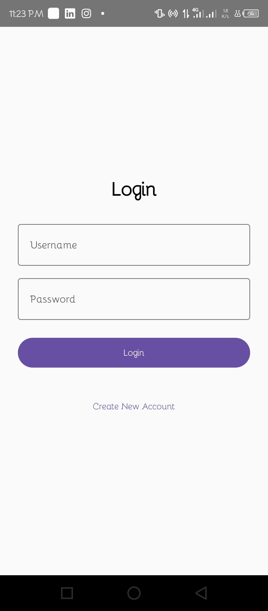
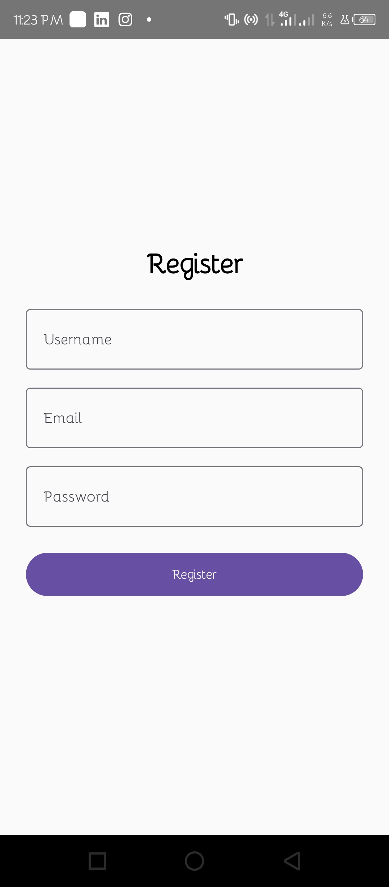

# Assignment - User Authentication App

A simple Android application developed using **Jetpack Compose**, **Room Database**, and **Navigation Compose**.

## Features

- User Registration
- User Login
- Room Database Integration
- Home Screen with Welcome Message
- Logout Functionality
- Navigation Between Screens

## Technologies Used

- Kotlin
- Jetpack Compose
- Room Database
- Navigation Compose
- Android Studio

## Project Structure

```
data/
├── AppDatabase.kt
├── User.kt
└── UserDao.kt

navigation/
└── Navigation.kt

screens/
├── LoginScreen.kt
├── RegisterScreen.kt
└── HomeScreen.kt
```

## Screenshots

### Login Screen



### Register Screen



### Home Screen


## Database Structure

### User Entity

| Field | Type |
|---------|---------|
| id | Int |
| username | String |
| email | String |
| password | String |

## Functional Requirements

### Registration

- Enter Username
- Enter Email
- Enter Password
- Validate Inputs
- Save User to Room Database
- Navigate to Login Screen

### Login

- Enter Username
- Enter Password
- Verify Credentials
- Navigate to Home Screen

### Home

- Display Logged-in Username
- Logout Option

